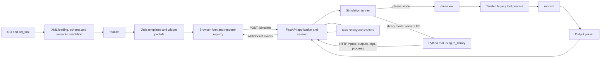

# rappture2web Design

## Purpose and review status

rappture2web turns a Rappture `tool.xml` definition into a browser-based
application. Its primary purpose is to keep existing Rappture tools useful
without the desktop GUI while providing a stricter, contract-based format for
new tools.

This document is a maintainer-oriented review of the **current working tree**,
including work that may not yet be released. Sections headed "Current design"
describe implemented behavior. Sections headed "Recommended design" are a
roadmap and do not describe existing APIs.

The intended deployment is one trusted tool per server process, normally:

- bound to localhost for development; or
- placed behind an authenticating reverse proxy such as nanoHUB's session
  proxy.

The process intentionally permits one active simulation at a time. A second
`POST /simulate` is rejected with HTTP 409 instead of being queued. This is a
single-user application model, not a multi-tenant simulation service.

## Current design

### System overview



The main implementation boundaries are:

| Area | Current responsibility |
| --- | --- |
| [`cli.py`](rappture2web/cli.py) | Resolves the tool and nanoHUB environment, configures the application, and starts Uvicorn. |
| [`xml_parser.py`](rappture2web/xml_parser.py) | Loads tool and run XML, validates new-format contracts, constructs `ToolDef`, normalizes inputs, and decodes every output type. |
| [`app.py`](rappture2web/app.py) | Owns the FastAPI routes, global tool/session state, WebSocket clients, uploads, cache endpoints, and run-history API. |
| [`simulator.py`](rappture2web/simulator.py) | Creates driver XML, launches and stops trusted commands, parses results, manages UQ, local history, and remote caching. |
| [`rp_library.py`](rappture2web/rp_library.py) | Implements a compatibility subset of the classic Python Rappture API for file or HTTP operation. |
| [`templates/`](rappture2web/templates/) | Renders the tool chrome and the server-side input widget tree. |
| [`rappture.js`](rappture2web/static/js/rappture.js) and renderer modules | Collect inputs, manage browser state and WebSockets, display run history, and dispatch normalized outputs to registered renderers. |

Plotly, Three.js, renderers, styles, and geographic data are packaged with the
library. A deployed tool therefore does not depend on a CDN.

### Tool loading and rendering

The CLI calls `set_tool()`, which parses one `tool.xml` into a `ToolDef` and
creates a `RunHistory`. `ToolDef` contains tool metadata, an input widget tree,
an output declaration tree, a parsed contract when present, and source paths.

The root route passes that model to Jinja. Widget templates render the input
tree, including nested groups and phases. The browser collects values using
Rappture paths such as `input.number(temperature)`. Output XML and library-mode
messages are normalized to JSON-like dictionaries before reaching the browser.
Separate JavaScript files register renderers by normalized output type, which
keeps most visualization-specific behavior outside the main controller.

### Execution modes

Both modes begin with the same browser request and end with the same run-history
and rendering concepts, but their transport differs.

#### Classic mode

Classic mode is the compatibility path for Tcl, C, Fortran, Python, and other
existing Rappture tools:

1. The server copies the tool definition into a temporary driver XML and sets
   submitted values under `<current>`.
2. `@tool` and `@driver` are expanded in the tool's `<command>`.
3. The command runs in a subprocess and may modify the driver or produce a
   separate `run.xml`.
4. The simulator polls candidate run XML files for incremental outputs and
   performs a final parse after the process exits.
5. Parsed outputs are checked against a contract when one exists, recorded in
   history, and sent to browsers.

Classic output streaming is best-effort and file-based. It depends on the tool
updating a parseable XML file while it runs.

#### Library mode

Library mode is available to Python tools using `rappture2web.rp_library`:

1. The command receives the application URL in place of a driver path.
2. The compatibility library reads current inputs from `GET /api/inputs`.
3. Output writes, log messages, and progress updates are posted to the
   application and broadcast while the process is running.
4. The library signals completion through `POST /api/simulate/done`.

`rp_library` also accepts a file path, allowing the same adapted Python tool to
operate against driver XML in classic environments. It is a practical
compatibility layer, not yet a complete implementation of every historical
Rappture Python API.

### Sessions, events, history, and caching

The application stores the loaded tool, current session, subprocess, connected
WebSockets, and history in module-level state. The session is a dictionary with
the current job ID, inputs, outputs, log, progress, run identity, status, and
cache flag. New WebSocket clients receive a complete state snapshot and then
incremental unversioned messages such as `status`, `progress`, `log`, `output`,
and `done`.

Run history stores normalized inputs and outputs in memory. With `--cache-dir`,
each run is also written as a JSON file. The local cache key hashes submitted
inputs and the `tool.xml` modification time. Classic mode can additionally use
a remote cache service that exchanges anonymized run XML.

### Format compatibility and Rappture 2.x

rappture2web supports two related document policies:

| Document kind | Detection | Validation policy |
| --- | --- | --- |
| Legacy Rappture | No schema location and no 2.x schema version | Parse the runtime `<input>` and `<output>` trees permissively; a contract is optional. |
| New format / Rappture 2.x | An `xsi:noNamespaceSchemaLocation`, or a `<tool><version>` schema value beginning with `2.` | Require `<tool><contract>` and validate the declared interface. |

A contract is the authoritative machine-facing declaration of data inputs and
outputs. The root-level `<input>` and `<output>` sections remain the runtime UI
description. This separation allows layout elements such as groups, phases,
notes, loaders, drawings, and separators without making them part of the tool's
data contract.

Validation currently occurs in four layers:

1. **Schema validation:** a declared XSD is resolved relative to the tool; when
   a contract exists without an explicit schema, the bundled
   [`contract.xsd`](rappture2web/contract.xsd) is used.
2. **Contract semantics:** required labels, descriptions, defaults, numeric
   bounds, choices, duplicate singleton elements, and related rules are
   checked in Python.
3. **Contract/runtime consistency:** data input IDs and types must agree with
   the runtime UI, and units/min/max may not conflict. Runtime output
   declarations must agree when present; dynamically produced outputs need not
   be predeclared in the runtime `<output>` section.
4. **Produced-output validation:** classic and library modes reject undeclared
   or type-incompatible output, and a successful run is downgraded when a
   declared output is missing. Internal `__...__` report outputs are exempt.

The code therefore already treats contracts as more than documentation.
However, the precedence rules between duplicated contract and runtime metadata
are implicit in validation code rather than stated as a stable format policy.

### Trust and security boundary

`<command>` is intentionally executed through a shell because legacy Rappture
commands may contain environment assignments, pipes, redirections, or command
chains. Consequently, **tool XML and all referenced tool files are executable,
trusted application code**. Loading user-supplied tool definitions would be
equivalent to allowing arbitrary command execution.

The HTTP and WebSocket routes do not authenticate users. Any connected client
can observe current inputs, outputs, logs, and broadcasts, and several routes
mutate the active session or history. The server must remain bound to localhost
or behind an authentication and authorization boundary. The run-XML upload is
data input, not authorization to upload a tool, and is disabled on nanoHUB.

Existing tests cover contract validation, path traversal, upload policy,
subprocess cleanup, HTML sanitization, session behavior, and parser edge cases.
These tests are valuable guardrails, but they do not turn the process into a
public multi-user service.

## Findings

### Strengths

- The classic driver/run XML path preserves tools written in multiple legacy
  languages without requiring rewrites.
- The Python compatibility library offers a gradual path to live output and
  progress streaming.
- Tool and run parsing are shared rather than reimplemented by each renderer.
- The renderer registry gives output types a clear browser extension point.
- Bundled browser assets make deployments reproducible and usable without CDN
  access.
- Contract checks share the same output compatibility helpers across classic
  and library execution.
- Focused regression tests show deliberate attention to unsafe paths and
  malformed XML behavior.

### Risks and improvement opportunities

1. **Core modules have too many responsibilities.** `xml_parser.py` validates
   contracts, builds UI models, sanitizes notes, and decodes all result types.
   `simulator.py` combines XML mutation, process management, UQ, persistence,
   and remote caching. `app.py` combines composition, protocol routes, mutable
   state, and storage operations. This increases the impact of changes and
   makes narrow unit tests harder.

2. **Global mutable state defines the architecture accidentally.** The
   single-run policy is valid, but module globals make it difficult to create
   isolated application instances, test concurrent clients, host more than one
   tool, or reason about stale callbacks. The policy should belong to an
   explicit runtime object.

3. **The two execution paths can drift.** Classic and library modes have
   separate completion, history, streaming, and error paths. Contract output
   helpers are shared, but the overall lifecycle is not represented once.

4. **Protocol objects are implicit dictionaries.** Internal callbacks, HTTP
   bodies, WebSocket events, parsed outputs, sessions, and run results rely on
   conventions rather than typed, versioned interfaces. Missing keys and
   inconsistent terminal events are therefore discovered at runtime.

5. **Contract precedence is under-specified.** Contract and runtime sections
   repeat type, units, bounds, defaults, labels, and descriptions. Current code
   rejects some conflicts but does not give tool authors a concise rule for
   which source owns every field.

6. **Cache invalidation is incomplete.** Inputs plus the `tool.xml` mtime do not
   detect changes to scripts, binaries, included data, environment packages, or
   the rappture2web parser itself. An old result can therefore appear valid
   after executable behavior changes.

7. **History persistence is minimal.** Per-run JSON writes are not atomic,
   retention is unbounded, load errors are silently skipped, renumbering is
   partly derived from file order, and output payloads may become large.

8. **The security model is deployment-dependent.** Trusted shell execution is
   necessary for compatibility, but the unauthenticated application must never
   be exposed directly. This constraint needs to be prominent in installation
   and operations documentation.

9. **Documentation trails implementation.** The user guide does not yet explain
   contracts or the 2.x version gate, and its classic-mode streaming description
   does not account for incremental run-XML polling.

10. **Frontend orchestration is still concentrated.** Output renderers are
    modular, but the main JavaScript controller also owns transport, form state,
    history, comparison, downloads, reconnection, and UI orchestration.

## Recommended design

The recommendations below preserve legacy behavior. They are staged so that
each phase produces useful boundaries without requiring a full rewrite.

### Stable invariants

Treat these as compatibility promises during refactoring:

- Existing legacy `tool.xml` documents remain valid without a contract.
- Classic tools continue to receive driver XML and may modify it in place or
  report another run XML.
- Existing adapted Python tools continue to use the current `rp_library` API.
- A 2.x/new-format marker requires a valid contract.
- Contract violations cannot be hidden by a zero process exit code.
- The initial runtime remains one tool and one active simulation per process;
  overlapping runs are rejected rather than queued.
- Existing browser and HTTP behavior remains compatible until a separately
  versioned API is introduced.

### Typed domain and protocol boundaries

Add internal typed models for at least:

- `ToolDefinition`, `ToolContract`, and runtime widget/output declarations;
- `RunRequest` and normalized input values;
- `RunEvent` variants for status, progress, log, output, and completion;
- `RunResult`, `RunRecord`, and `SessionState`.

Dataclasses or Pydantic v1 models are both compatible with the current package
constraints. Models should be converted to dictionaries only at the Jinja and
HTTP/WebSocket boundaries. Preserve the existing wire shapes initially.

For new internal events, use an envelope such as:

```json
{
  "version": 1,
  "type": "output",
  "job_id": "8-character-id",
  "sequence": 12,
  "payload": {"id": "fermi", "data": {"type": "curve"}}
}
```

The envelope makes ordering, stale-job rejection, reconnect replay, and future
protocol evolution explicit. It should first be an internal representation
adapted to current messages. A public `/api/v1` is a later decision, not a
requirement of the refactor.

### Parser pipeline

Split the current parser conceptually, then physically, into:

1. secure XML document loading and source resolution;
2. format/version detection;
3. XSD validation;
4. contract parsing and semantic validation;
5. runtime UI model construction and contract reconciliation;
6. run-output decoding and normalization.

Use registries for input and output codecs instead of continuing to grow one
module-level conditional tree. A codec should declare the XML tags it accepts,
its normalized model, and its validation/decoding behavior. The bundled schema
taxonomy and Python registry should be checked for consistency in tests.

The format policy should state the following precedence:

- The contract owns data IDs, types, accepted values, units, bounds, and the
  set of required outputs.
- Runtime sections own grouping, ordering, phases, notes, icons, hints,
  presentation color, and renderer layout.
- Runtime defaults may specialize a contract default only if an explicitly
  documented policy permits it; until then, require equality.
- Runtime labels/descriptions may provide presentation wording, while the
  contract must retain complete standalone labels/descriptions for API users.
- Any runtime value constrained by the contract must remain within the
  contract; conflicts are load-time errors.

### Unified execution lifecycle

Define an execution backend interface with classic and library adapters. Both
adapters emit the same `RunEvent` stream and return the same `RunResult`.
Lifecycle orchestration should own, exactly once:

- start and terminal state transitions;
- log and progress accumulation;
- output contract checks;
- cancellation and subprocess cleanup;
- missing-output validation;
- history recording and cache publication;
- one terminal browser notification.

Classic mode translates process output and run-XML polling into events. Library
mode translates compatibility API posts into events associated with the active
job. This leaves transport differences inside adapters rather than in route and
completion logic.

### Application-scoped runtime

Replace module globals with a `ToolRuntime` created by an application factory.
It should own the immutable tool definition and configuration plus a
`SessionManager`, execution coordinator, history store, and connected-client
publisher. Routes retrieve the runtime through application state or dependency
injection.

`SessionManager` should enforce the existing single-run rule with a lock and
job identity. Every tool-originated library request and emitted event should be
checked against the active job where possible. This change enables isolated
tests and multiple server instances without committing to multi-user support.

### Cache and history

Replace the local cache key with a versioned tool fingerprint derived from:

- normalized submitted inputs;
- canonicalized tool definition and format/schema version;
- the command and hashes of known referenced scripts or binaries;
- the rappture2web version and output-normalization version;
- optional operator-provided environment/dependency identity.

Store fingerprint metadata with every run so misses can be explained. Write
history records atomically using a temporary file plus rename, report corrupt
records, and support configurable maximum runs, maximum bytes, and/or age.
Hide storage behind a `RunStore` interface so JSON files can later be replaced
without changing simulation or route logic.

### Frontend boundaries

Keep the existing renderer registry. Gradually extract four modules from the
main controller:

- simulation transport and versioned event handling;
- form collection, enable expressions, and input state;
- run-history and comparison state;
- renderer selection and layout orchestration.

Renderer modules should continue to receive normalized output models and must
not parse Rappture XML. Reconnection tests should verify state snapshots,
duplicate event handling, active-job filtering, and output resizing.

## Delivery roadmap

### Phase 1: specify and protect behavior

- Publish this architecture and the contract precedence rules in user-facing
  format documentation.
- Correct the classic-mode streaming description.
- Add end-to-end fixtures for legacy and 2.x tools in both execution paths.
- Define lifecycle and protocol invariants in tests before refactoring.

### Phase 2: add boundaries without behavior changes

- Introduce typed models and the internal event envelope.
- Split the parser pipeline and establish codec registries.
- Add classic and library execution adapters behind shared orchestration.
- Adapt typed events back to existing HTTP/WebSocket payloads.

### Phase 3: isolate state and persistence

- Add an application factory, `ToolRuntime`, and `SessionManager`.
- Replace direct history access with `RunStore`.
- Add tool fingerprints, atomic writes, retention, and diagnostics.

### Phase 4: expand only when required

- Consider multiple concurrent sessions only with an explicit isolation,
  authorization, resource quota, and storage design.
- Introduce `/api/v1` only when an external consumer needs a supported public
  API; otherwise keep the protocol internal.

## Acceptance and regression scenarios

The architecture is protected when the following scenarios are automated:

| Scenario | Expected behavior |
| --- | --- |
| Legacy classic tool | A contract-free tool receives current values in driver XML, exits successfully, and its final or incrementally updated run XML renders correctly. |
| Python library tool | Inputs are read over HTTP; progress, log, and output events appear before completion; one successful run is recorded. |
| Valid Rappture 2.x tool | Schema, contract semantics, and runtime declarations validate; all declared outputs are accepted and rendered. |
| Missing 2.x contract | Tool loading fails with a concise error identifying the version/schema marker and missing contract. |
| Contract mismatch | Conflicting input metadata, undeclared outputs, wrong output types, and missing required outputs fail at the appropriate load or run stage. |
| Cancellation | The subprocess is terminated and reaped, the session becomes stopped, and exactly one terminal event is emitted. |
| Local or remote cache hit | Execution is skipped, the cached result is parsed and rendered, and history/session metadata identifies the result as cached. |
| Run XML upload | Oversized or malformed documents are rejected, nanoHUB uploads remain disabled, and accepted data cannot escape configured storage paths. |
| WebSocket reconnect | A reconnect receives a coherent snapshot and does not duplicate or replace outputs with stale-job events. |
| Overlapping simulation | A second request receives HTTP 409 and cannot replace the active session or subprocess. |
| Corrupt history record | Startup reports and skips the record without losing valid neighboring records. |

Unit tests should additionally cover parser stages, codec registration, event
serialization, lifecycle state transitions, cache fingerprint inputs, and
atomic store behavior. Browser tests should cover renderer dispatch and
reconnection with representative scalar, curve, table, field, and drawing
outputs.

## Review verification and limitations

This review was performed against a working tree containing uncommitted changes
in core modules and new tests. Those changes were treated as the current design
baseline, not as released behavior. No unrelated files were modified.

The configured project suite was run after the review changes:

- `176` non-visual tests passed under `.venv`.
- All `40` browser cases passed, covering the five requested viewports, two
  real iframe sizes, footer non-overlap, horizontal overflow, results sizing,
  the remembered pane switch, fullscreen, and real curve, 2D/3D field, and
  Crystal Viewer result XML.
- Python compilation and JavaScript syntax checks passed.

A bare repository-wide `pytest` also collects two upstream legacy example
tests outside `tests/`. Those require the separately installed classic
`Rappture` Python package and fail collection when it is unavailable; the
rappture2web suite should be invoked against `tests/` unless that external
compatibility environment is installed.
